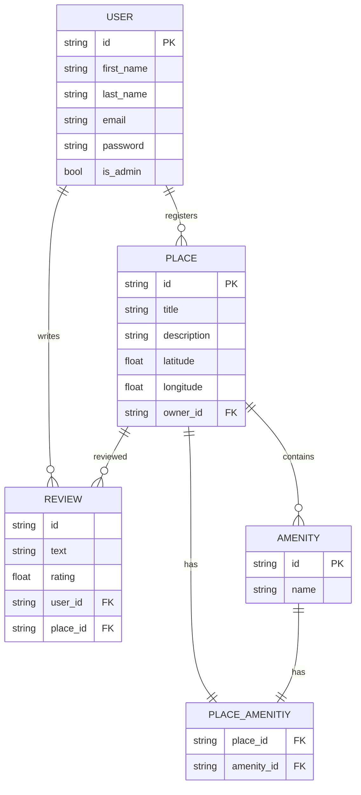

# Holberton Bed&Breakfast

Getting started in making the Hbnb project!

## Contents

## Part 1

Documents:

- High Level Package Diagram

    Shows the relationship between our three layers (Presentation, Business Logic, Persistance)

- Class Diagram

    Shows the relationship between the four classes that we are planning to use which are:

    * User
    * Place
    * Review
    * Amenity

    The diagram also contains information about the attributes and methods of the individual classes.

- Sequence Diagram

  Shows the design of our API calls which are:
  
    * User Registration
    * Place Creation
    * Review Submission
    * Fetch List of Places

- Technical Document

  Shows the overall content of part 1 in one file. Contains all the diagrams with appropriate explaination.

## Part 2

  This part contains the implementation of the designs from Part 1 which has been divided into 5 sections.

  - api

    Contains the design and implementation of different end points for the 4 classes.

  - models

    Contains the object structure of each class.

  - persistence

    Contains the repository which has the methods that the methods in facade reference.

  - services

    Contains the facade which does the bulk of the operation called by the api.

  - tests

    Contains test files to test each of the end points of the 4 classes.

Please navigate into the "part2" folder to see the listed examples of trial codes that you can use to test the design.

## Part 3

Listed below is the entity relationship diagram depicting the relationships between each class of the clone, made in part 3 of the project. It has been created using mermaid.js

Relationships

- User has one-to-many relationship with Place.
- User has one-to-many relationship with Review.
- Place has one-to-many relationship with review.
- Place has one-to-many relationship with Amenity.
- Place has one-to-one relationship with Place_Amenity.
- Amenity has one-to-one relationship with Place_Amenity.
  
## Authors

- 	Aaron Regterschot
- 	Ethan Hill
- 	Sijin Singh
- 	Vengour Heng
